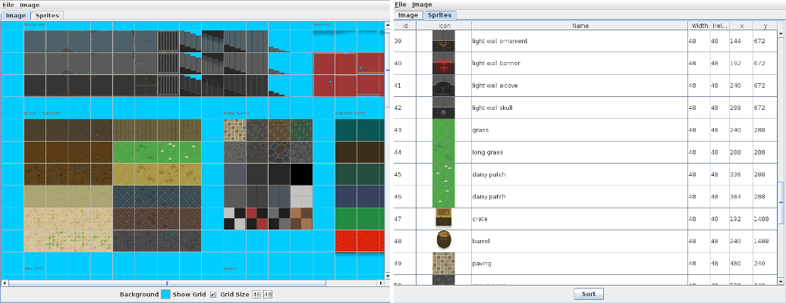

Sprite Maker
============

This is a utility to automate creating sprite clip data from a texture sheet. Select an image which will be displayed in the image tab. Clicking on areas of this image will calculate the sprite coordinates based on the dimensions of a single sprite (configurable), and a grid can be overlayed to help figure out the dimensions. The background color can be changed to something that contrasts will with the sprite graphics. Each click will add the sprite to a list of sprites which are displayed in the Sprites tab.

|  | 
|:--:| 
| *Sprite Maker image and sprite view example showing [Oryx Ultimate Fantasy Tileset](https://www.oryxdesignlab.com/ultimatefantasy/).* |

After selecting a bunch of sprites and giving them an optional description, the saved document will look like this:

```
# Sprite Maker v0.1

file:/path/to/data/gfx/uf_terrain.png

# Format: id:desc:width:height:x:y:[x2:y2...]
# All values in pixels, origin at top left.
# Additional x,y pairs represent frames.

0:empty:48:48:624:336
1:light stone floor:48:48:48:48
...
43:grass:48:48:240:288
44:long grass:48:48:288:288
45:daisy patch:48:48:336:288
46:daisy patch:48:48:384:288
47:crate:48:48:192:1488
48:barrel:48:48:240:1488
49:paving:48:48:480:240
50:gray paving:48:48:528:240
...
```
