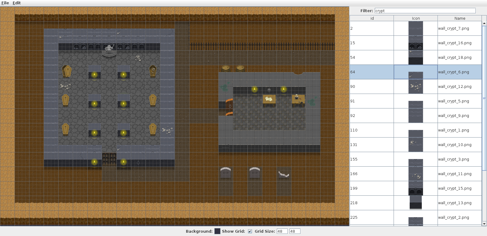
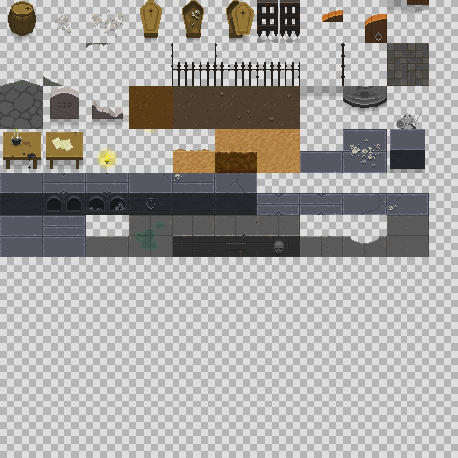

Sprite Editor
=============

This is a small utility to automatically generate a texture atlas (sprite 
sheet) from a sample scene.

The main window is divided into two regions:
 * On the right hand side, an image library which can be changed by loading 
 a new directory via `File -> Load`
 
 * On the left is a drawing canvas. Selecting an image in the library and
 clicking (or box-selecting) within the canvas will place instances of that
 image in the sample scene.
 
Sprites placed in the scene will be aligned to the grid lines, and this can
be adjusted at the bottom of the window to match the dimensions of the images
being used.

|  |
|:--:|
| *Sprite Maker image and sprite view example showing [Oryx Ultimate Fantasy Tileset](https://www.oryxdesignlab.com/ultimatefantasy/).* |

Once you have finished laying out a sample scene, choosing `File -> Export` will
let you render the texture atlas to a file. The resulting image will contain a
map of the unique sprites used in the sample scene, and the sprites will be
packed into the smallest square image with power-of-2 dimensions.

|  |
|:--:|
| Texture atlas produced from above sample scene. |

### Operations

* `File->Open` Open a saved sample scene.
* `File->Save` Save a sample scene to continue working later.
* `File->Load` Load an image library from a directory.
* `File->Export` Export a texture atlas image from the current sample scene.
* `File->Quit` Exit Sprite Editor.
* `Edit->Undo` Undo the most recently placed sprite.
* `Edit->Reset` Remove all sprites from the sample scene. (Irreversible.)
* `Background` Change the background colour.
* `Show Grid` Toggle grid line display
* `Grid Size` Change the width and height (in pixels) of individual sprites.
* `Filter` Search for specific terms in the image library.
